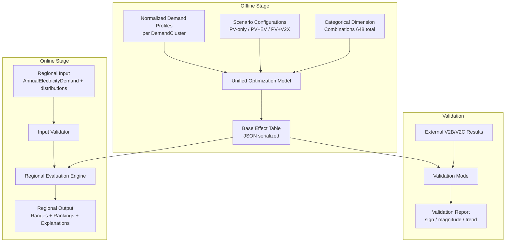

# Design Document: V2X Decision Support Simulator

## Overview

The V2X Decision Support Simulator is a two-stage simulation system that evaluates V2X (Vehicle-to-Everything) energy technology effectiveness across structural conditions without generating region-specific demand time-series. The system operates as a standalone Python project (`V2X_Decision_Support_Simulator/`) coexisting with but independent from the existing `V2B_simulation` and `V2C_Simulation` codebases.

This simulator is motivated by the following tension: (i) constructing detailed region-specific time-series demand data is not practical, while (ii) V2X effectiveness cannot be meaningfully discussed under a single nationwide average assumption. To address this, the simulator explicitly abstracts only the structural factors that fundamentally determine V2X operational behavior and effectiveness—namely demand structure, EV usage patterns, PV installation constraints, and electricity pricing regimes. The system therefore adopts a two-stage architecture: (Offline) the V2X response to all representative structural conditions is precomputed, and (Online) regional characteristics are mapped to these responses via categorical distributions, without generating region-specific demand time series.

The architecture follows a precompute-then-aggregate pattern:

1. **Base Effect Simulator (Offline)**: Solves a unified linear optimization model across all 648 categorical scenario combinations (2 × 3 × 3 × 3 × 4 × 3), storing dimensionless relative effect metrics in a Base Effect Table.
2. **Regional Evaluation Engine (Online)**: Accepts regional categorical distributions and a single scalable input (AnnualElectricityDemand), aggregates Base Effect Table entries via weighted summation, and produces range-based results with structural explanations.

Key design decisions:
- All optimization uses normalized demand profiles (dimensionless), never region-specific time-series
- A single optimization model with constraint switching isolates V2X effects cleanly across three scenarios
- PV capacity is re-optimized per scenario rather than fixed from a prior scenario
- The only absolute-unit input at the regional level is AnnualElectricityDemand (kWh)
- JSON is the serialization format for the Base Effect Table (structured, versionable, schema-validatable)

Technology stack: Python 3.10+, scipy/cvxpy for optimization, pandas for data handling, JSON for serialization, Hypothesis for property-based testing, pytest for test framework.

## Architecture



The system has three top-level modules:

| Module | Responsibility | Execution Mode |
|--------|---------------|----------------|
| `base_effect_simulator` | Optimization model, scenario switching, BET generation | Offline (batch) |
| `regional_evaluation_engine` | Input validation, aggregation, output formatting | Online (per-query) |
| `validation` | Consistency checks against external simulators | On-demand |

Data flows strictly one-way from offline to online. The Base Effect Table is the sole interface between stages — serialized as JSON, loaded at engine startup.

## Components and Interfaces

### 1. Categorical Dimensions Module (`v2x_dss/categories.py`)

Defines all categorical enumerations and their valid values as Python Enums:

```python
class BuildingType(Enum):
    COMMERCIAL = "Commercial"
    RESIDENTIAL = "Residential"

class DemandCluster(Enum):
    CLUSTER_1 = "Cluster_1"
    CLUSTER_2 = "Cluster_2"
    CLUSTER_3 = "Cluster_3"

class EVUsageType(Enum):
    PRIVATE = "Private"
    COMMUTING = "Commuting"
    FLEET = "Fleet"

class EVEffectiveCapacityCategory(Enum):
    """
    Represents the amount of energy effectively available for V2X operation,
    normalized by annual demand. This category implicitly aggregates battery
    capacity (kWh), connection rate, operational allowance, and degradation
    considerations. Power limits and availability timing are represented
    separately through EVUsageType (Private / Commuting / Fleet). This
    abstraction is intentional: it does not aim to replace detailed EV
    physical models, but rather to capture the dominant first-order
    constraints relevant for early-stage V2X deployment decisions.
    """
    LOW = "Low"
    MEDIUM = "Medium"
    HIGH = "High"

class PVUpperLimitCategory(Enum):
    PCT_0 = "0%"
    PCT_20 = "20%"
    PCT_50 = "50%"
    PCT_80 = "80%"

class PricingRegime(Enum):
    ENERGY_DOMINANT = "EnergyDominant"
    MIXED = "Mixed"
    CAPACITY_DOMINANT = "CapacityDominant"

class Scenario(Enum):
    PV_ONLY = "PV-only"
    PV_EV_NO_V2X = "PV+EV-no-V2X"
    PV_V2X = "PV+V2X"
```

Provides `ScenarioKey` as a `NamedTuple` of the six categorical indices, and `all_scenario_keys()` to enumerate all 648 combinations.

### 2. Optimization Model (`v2x_dss/optimization_model.py`)

A single function `solve_scenario(demand_profile, scenario, params) -> ScenarioResult` that:
- Accepts a normalized demand profile (numpy array, T time steps)
- Accepts scenario enum to determine constraint switches
- Accepts parameter dict with PV upper limit fraction, EV capacity fraction, pricing weights
- Returns `ScenarioResult` dataclass with optimal PV capacity ratio, total cost ratio, peak ratio

The Base Effect Table (BET) adopts a minimal scenario set designed to isolate incremental value along a realistic deployment pathway: PV-only, PV + EV (without V2X control), PV + V2X. This structure cleanly separates the marginal impact of EV storage and V2X control. Additional scenarios—such as no-PV baseline, PV re-optimization after V2X introduction, or joint optimization—are treated as structural validation and sensitivity analysis, and are intentionally separated from the core BET definition to preserve interpretability.

Constraint switching logic:
- **PV-only**: `ev_charge[t] = 0, ev_discharge[t] = 0` for all t
- **PV+EV-no-V2X**: `ev_charge[t] >= 0, ev_discharge[t] = 0` for all t
- **PV+V2X**: `ev_charge[t] >= 0, ev_discharge[t] >= 0` (up to limit) for all t

The model minimizes total normalized cost = Σ(grid_import[t] × price[t]) subject to power balance, SoC bounds, and PV generation constraints. PV capacity is a decision variable re-optimized in each scenario.

### 3. Base Effect Simulator (`v2x_dss/base_effect_simulator.py`)

Orchestrates the offline computation:

```python
def compute_base_effect_table(demand_profiles: Dict[DemandCluster, np.ndarray],
                               ev_availability: Dict[EVUsageType, np.ndarray],
                               pricing_profiles: Dict[PricingRegime, np.ndarray]
                               ) -> BaseEffectTable
```

For each of the 648 `ScenarioKey` combinations:
1. Select the normalized demand profile for the DemandCluster
2. Configure EV parameters from EVUsageType and EVEffectiveCapacityCategory
3. Set PV upper bound from PVUpperLimitCategory
4. Set pricing weights from PricingRegime
5. Solve three scenarios (PV-only, PV+EV-no-V2X, PV+V2X)
6. Compute relative metrics and incremental effects
7. Validate all metrics are dimensionless (no absolute units)
8. Store in BaseEffectTable

### 4. Base Effect Table (`v2x_dss/base_effect_table.py`)

Data structure and serialization:

```python
@dataclass
class BaseEffectEntry:
    scenario_key: ScenarioKey
    pv_only: ScenarioMetrics
    pv_ev: ScenarioMetrics
    pv_v2x: ScenarioMetrics
    incremental_ev: IncrementalEffect      # PV-only → PV+EV
    incremental_v2x: IncrementalEffect     # PV+EV → PV+V2X

@dataclass
class ScenarioMetrics:
    optimal_pv_ratio: float        # PV capacity / annual demand (dimensionless)
    cost_reduction_ratio: float    # percentage
    peak_reduction_ratio: float    # percentage

@dataclass
class IncrementalEffect:
    cost_delta: float              # percentage point change
    peak_delta: float              # percentage point change
```

`BaseEffectTable` wraps a `Dict[ScenarioKey, BaseEffectEntry]` with:
- `get(key) -> BaseEffectEntry`: exact lookup, raises KeyError if missing
- `serialize(path)`: writes JSON
- `deserialize(path) -> BaseEffectTable`: reads JSON, validates schema
- `validate_no_absolute_units()`: checks all stored values are dimensionless ratios

**Design Note — BET as a Structural Map:** The Base Effect Table should not be interpreted as a static result repository. Rather, it functions as a structural map of V2X effectiveness, systematically revealing how key parameters constrain or amplify V2X value. By varying EV capacity categories, PV limits, and pricing regimes across the table, the simulator enables analysis of saturation effects, regime shifts, and limiting factors—providing causal explanations for regional evaluation results.

### 5. Regional Evaluation Engine (`v2x_dss/regional_evaluation_engine.py`)

```python
def evaluate(regional_input: RegionalInput, table: BaseEffectTable) -> RegionalOutput
```

**Input validation** (strict):
- `AnnualElectricityDemand`: positive float in kWh — the only scalable numeric input
- `BuildingTypeMix`: dict mapping BuildingType → weight, must sum to 1.0 ± 0.001
- `DemandClusterDistribution`: dict mapping DemandCluster → weight, must sum to 1.0 ± 0.001
- `EVUsageTypeDistribution`: dict mapping EVUsageType → weight, must sum to 1.0 ± 0.001
- `PVUpperLimitCategory`: single enum value (constraint selector)
- `EVEffectiveCapacityCategory`: single enum value (constraint selector)
- `PricingRegime`: single enum value (constraint selector)
- Rejects any input containing `max_demand`, `pv_capacity_kw`, `ev_capacity_kwh` or similar absolute-unit fields

**Aggregation procedure**:
1. Filter BET entries matching the constraint-selection inputs (PVUpperLimitCategory, EVEffectiveCapacityCategory, PricingRegime)
2. For each matching entry, compute weight = BuildingTypeMix[bt] × DemandClusterDistribution[dc] × EVUsageTypeDistribution[ev]
3. Compute ExpectedEffect = Σ(weight_i × effect_i)
4. Compute min/max from individual entry effects
5. Scale by AnnualElectricityDemand only for absolute output estimates

**Output**:
```python
@dataclass
class RegionalOutput:
    cost_reduction: EffectRange          # min, expected, max (relative %)
    peak_reduction: EffectRange          # min, expected, max (relative %)
    absolute_cost_savings: EffectRange   # scaled by AnnualElectricityDemand
    v2x_ranking: List[RankedOption]      # ordered by expected effectiveness
    explanation: ResultExplanation        # textual explanation of driving factors
    limiting_factors: List[str]          # which constraints limited the effect
```

### 6. Explanation Generator (`v2x_dss/explanation.py`)

Produces structured textual explanations by:
- Identifying which categorical dimension contributes most variance to the weighted result
- Reporting which constraints (PV limit, EV capacity) bound the V2X effect
- When ranking multiple options, explaining why the top option dominates by referencing specific categorical conditions
- When V2X benefit is minimal, identifying the primary structural limiting factor

### 7. Validation Mode (`v2x_dss/validation.py`)

```python
def validate(bet_entry: BaseEffectEntry, 
             detailed_result: DetailedSimulationResult) -> ValidationReport
```

Maps detailed simulation parameters to categorical indices, then compares:
- **Sign check**: effect direction matches (both positive or both negative)
- **Magnitude check**: same order of magnitude (within 10×)
- **Sensitivity trend check**: parameter sensitivity rankings agree

Each check reports pass/fail independently. No exact numerical equality required.

## Data Models

### Normalized Demand Profiles

Imported (copied) from V2B_simulation clustering outputs. Each profile is a 168-element array (7 days × 24 hours) normalized to [0, 1] range. Three cluster centroids (Cluster_1, Cluster_2, Cluster_3) serve as representative demand shapes. The existing V2B_simulation uses `TimeSeriesKMeans` with Euclidean distance on weekly normalized demand patterns.

### Base Effect Table Schema (JSON)

```json
{
  "version": "1.0",
  "generated_at": "2024-01-01T00:00:00Z",
  "entries": [
    {
      "key": {
        "building_type": "Commercial",
        "demand_cluster": "Cluster_1",
        "ev_usage_type": "Private",
        "ev_capacity_category": "Low",
        "pv_upper_limit": "20%",
        "pricing_regime": "EnergyDominant"
      },
      "pv_only": {
        "optimal_pv_ratio": 0.15,
        "cost_reduction_ratio": 8.5,
        "peak_reduction_ratio": 3.2
      },
      "pv_ev": {
        "optimal_pv_ratio": 0.18,
        "cost_reduction_ratio": 10.1,
        "peak_reduction_ratio": 5.0
      },
      "pv_v2x": {
        "optimal_pv_ratio": 0.20,
        "cost_reduction_ratio": 14.3,
        "peak_reduction_ratio": 9.8
      },
      "incremental_ev": { "cost_delta": 1.6, "peak_delta": 1.8 },
      "incremental_v2x": { "cost_delta": 4.2, "peak_delta": 4.8 }
    }
  ]
}
```

### Regional Input Schema

```python
@dataclass
class RegionalInput:
    annual_electricity_demand_kwh: float
    building_type_mix: Dict[BuildingType, float]
    demand_cluster_distribution: Dict[DemandCluster, float]
    ev_usage_type_distribution: Dict[EVUsageType, float]
    pv_upper_limit_category: PVUpperLimitCategory
    ev_effective_capacity_category: EVEffectiveCapacityCategory
    pricing_regime: PricingRegime
```

### Project Directory Structure

```
V2X_Decision_Support_Simulator/
├── v2x_dss/
│   ├── __init__.py
│   ├── categories.py
│   ├── optimization_model.py
│   ├── base_effect_simulator.py
│   ├── base_effect_table.py
│   ├── regional_evaluation_engine.py
│   ├── explanation.py
│   └── validation.py
├── data/
│   ├── demand_profiles/          # Copied cluster centroids from V2B
│   └── base_effect_table.json    # Precomputed BET
├── tests/
│   ├── test_categories.py
│   ├── test_optimization_model.py
│   ├── test_base_effect_table.py
│   ├── test_regional_evaluation_engine.py
│   ├── test_validation.py
│   └── test_properties.py        # Property-based tests
├── requirements.txt
└── README.md
```


## Correctness Properties

*A property is a characteristic or behavior that should hold true across all valid executions of a system — essentially, a formal statement about what the system should do. Properties serve as the bridge between human-readable specifications and machine-verifiable correctness guarantees.*

### Property 1: Base Effect Table serialization round-trip

*For any* valid `BaseEffectTable` instance, serializing to JSON and then deserializing the result SHALL produce a `BaseEffectTable` equivalent to the original — all 6 categorical indices and all metric values preserved exactly.

**Validates: Requirements 12.1, 12.2, 12.3**

### Property 2: Disallowed absolute-unit inputs are rejected

*For any* input dict containing a field named `max_demand`, `pv_capacity_kw`, `ev_capacity_kwh`, or any other absolute-unit numeric parameter, the Regional Evaluation Engine SHALL reject the input and return an error message that identifies the specific disallowed parameter name.

**Validates: Requirements 1.3, 6.4**

### Property 3: Distribution weight validation

*For any* categorical distribution input (BuildingTypeMix, DemandClusterDistribution, or EVUsageTypeDistribution), if the weights sum to a value outside the range [0.999, 1.001], the Regional Evaluation Engine SHALL reject the input. If the weights sum within that tolerance, the input SHALL be accepted.

**Validates: Requirements 6.5**

### Property 4: Scenario constraint satisfaction

*For any* valid normalized demand profile and parameter set, solving the optimization model under each scenario SHALL produce a solution where: (a) PV-only has ev_charge = 0 and ev_discharge = 0 for all time steps, (b) PV+EV-no-V2X has ev_charge ≥ 0 and ev_discharge = 0 for all time steps, (c) PV+V2X has ev_charge ≥ 0 and ev_discharge within [0, permitted_limit] for all time steps.

**Validates: Requirements 4.1, 4.2, 4.3**

### Property 5: Incremental effects equal scenario differences

*For any* Base Effect Table entry, the stored incremental_ev cost_delta SHALL equal (pv_ev.cost_reduction_ratio − pv_only.cost_reduction_ratio), and incremental_v2x cost_delta SHALL equal (pv_v2x.cost_reduction_ratio − pv_ev.cost_reduction_ratio). The same relationship SHALL hold for peak_delta fields.

**Validates: Requirements 5.2**

### Property 6: All stored metrics are dimensionless

*For any* Base Effect Table entry, all ScenarioMetrics fields (optimal_pv_ratio, cost_reduction_ratio, peak_reduction_ratio) and all IncrementalEffect fields (cost_delta, peak_delta) SHALL be dimensionless ratios or percentages — no value shall exceed plausible bounds for a ratio (e.g., optimal_pv_ratio in [0, 1], reduction ratios in [-100, 100]).

**Validates: Requirements 1.4, 5.1, 5.3**

### Property 7: Aggregation weights sum to 1.0

*For any* valid RegionalInput with valid categorical distributions, the computed aggregation weights (product of BuildingTypeMix × DemandClusterDistribution × EVUsageTypeDistribution for each applicable BET entry) SHALL sum to 1.0 within floating-point tolerance.

**Validates: Requirements 7.2**

### Property 8: Scaling linearity of absolute estimates

*For any* valid RegionalInput evaluated twice with different AnnualElectricityDemand values (D1 and D2, both positive), the relative effect ranges (cost_reduction, peak_reduction) SHALL be identical, and the absolute_cost_savings SHALL scale by the ratio D2/D1.

**Validates: Requirements 7.4**

### Property 9: Output ranges are well-ordered

*For any* valid RegionalOutput, the cost_reduction range SHALL satisfy min ≤ expected ≤ max, and the peak_reduction range SHALL satisfy min ≤ expected ≤ max.

**Validates: Requirements 8.1, 8.2**

### Property 10: V2X ranking is sorted by expected effectiveness

*For any* RegionalOutput containing a v2x_ranking list with more than one entry, the list SHALL be sorted in descending order of expected effectiveness.

**Validates: Requirements 8.3**

### Property 11: Every output includes explanation and limiting factors

*For any* valid RegionalInput that produces a RegionalOutput, the output SHALL contain a non-empty explanation referencing at least one categorical dimension name, and a non-empty limiting_factors list.

**Validates: Requirements 10.1, 10.2**

### Property 12: Base Effect Table lookup returns exactly one entry per valid key

*For any* valid ScenarioKey (a combination of the six categorical dimensions with values from their defined enumerations), querying a complete BaseEffectTable SHALL return exactly one BaseEffectEntry containing all required ScenarioMetrics and IncrementalEffect fields.

**Validates: Requirements 2.3**

## Error Handling

| Error Condition | Component | Behavior |
|----------------|-----------|----------|
| Absolute-unit input provided | RegionalEvaluationEngine | Raise `DisallowedInputError` with parameter name |
| Distribution weights don't sum to 1.0 | RegionalEvaluationEngine | Raise `InvalidDistributionError` with actual sum |
| Unknown categorical value | RegionalEvaluationEngine | Raise `InvalidCategoryError` with value and valid options |
| AnnualElectricityDemand ≤ 0 | RegionalEvaluationEngine | Raise `ValueError` with descriptive message |
| ScenarioKey not found in BET | BaseEffectTable | Raise `KeyError` with the missing key |
| Optimization infeasible | OptimizationModel | Raise `OptimizationError` with constraint details |
| Metric has absolute units | BaseEffectSimulator | Raise `AbsoluteUnitError` before storing |
| Malformed JSON during deserialization | BaseEffectTable | Raise `SerializationError` with structural problem description |
| Missing required fields in JSON | BaseEffectTable | Raise `SerializationError` listing missing fields |
| Validation mode: parameter mapping fails | ValidationMode | Raise `MappingError` with unmappable parameters |

All errors use custom exception classes inheriting from a base `V2XSimulatorError`. Error messages are descriptive and actionable — they identify what went wrong and what the caller should provide instead.

## Testing Strategy

### Unit Tests (pytest)

- Categorical dimension enumeration completeness (648 combinations)
- Optimization model constraint satisfaction for specific known cases
- BET lookup for specific keys
- Regional input validation edge cases (empty distributions, negative demand, boundary tolerance)
- Explanation generator output for known scenarios
- Validation mode sign/magnitude/trend comparisons with known pairs

### Property-Based Tests (Hypothesis)

Property-based testing is appropriate for this feature because the core logic involves:
- Pure functions with clear input/output behavior (optimization, aggregation, serialization)
- Universal properties that hold across a wide input space (constraint satisfaction, weight summation, round-trips)
- Mathematical invariants (incremental effects = differences, scaling linearity)

Library: **Hypothesis** (Python PBT library)
Configuration: minimum 100 iterations per property test
Tag format: `Feature: v2x-decision-support-simulator, Property {N}: {title}`

Each of the 12 correctness properties above maps to a single property-based test in `tests/test_properties.py`. Custom Hypothesis strategies will generate:
- Random valid `ScenarioKey` instances from enum combinations
- Random valid `BaseEffectEntry` instances with plausible metric ranges
- Random valid `BaseEffectTable` instances (subset of 648 entries for speed)
- Random valid `RegionalInput` instances with properly normalized distributions
- Random valid normalized demand profiles (168-element arrays in [0, 1])
- Random malformed JSON for deserialization error testing

### Integration Tests

- End-to-end: compute BET for a small subset of combinations, serialize, reload, evaluate a region
- Validation mode against known V2B_simulation outputs for representative cases
- Project isolation: verify no runtime imports from V2B_simulation or V2C_Simulation
